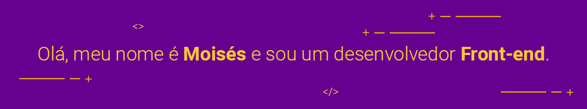

  

## 👋 Introdução

Sou um Desenvolvedor Front-End com conhecimentos em HTML, CSS, SCSS, JavaScript,
Typescript, React, Next.js, Node.js, Teste e com backgorund em animação e design.

  <a href="https://github.com/holymos">
  

## 💾 Conhecimento em:

 
  <a href="https://www.w3.org/html/" target="_blank"> 
  
  
  
  
  
  
  

 
  
  <a href="https://expressjs.com" target="_blank"> 
   

  
  ##
  
  ## 🌱 No momento estou aprendendo:
  Atualmente estou fazendo o bootcamp da Rocketseat focado em React e NextJS e outras tecnologias e práticas do mercado atual.
  
  
  ## 📫 How to reach me:
  

  
  

